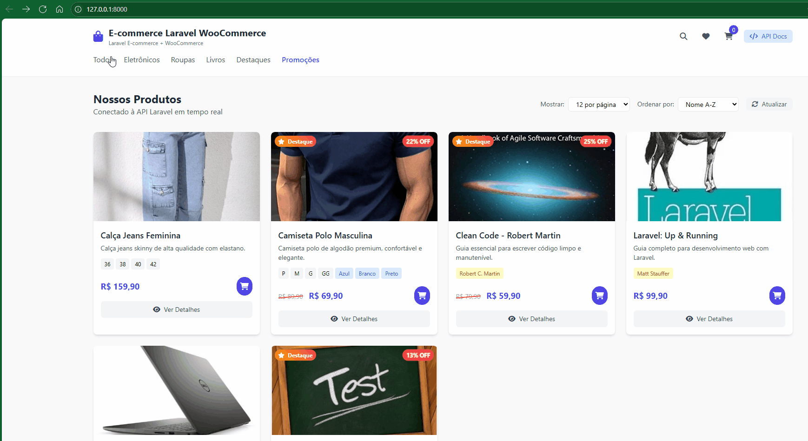

# 🛍️ E-commerce Laravel + WooCommerce Integration


# 🛒 Projeto E-Commerce Laravel + WooCommerce

Este projeto full stack demonstra minha capacidade de entregar soluções profissionais de e-commerce com integração completa ao WooCommerce via APIs RESTful, seguindo padrões de arquitetura limpa, boas práticas de desenvolvimento e foco em performance, segurança e escalabilidade.



## 🎯 Objetivo do Projeto

Demonstrar experiência prática com:

- ✅ **Laravel** - Framework PHP robusto
- ✅ **WooCommerce Integration** - APIs REST e sincronização
- ✅ **Clean Architecture** - SOLID, Repository Pattern, Service Layer
- ✅ **RESTful APIs** - Design e implementação
- ✅ **Queue Jobs** - Processamento assíncrono
- ✅ **Events & Listeners** - Arquitetura orientada a eventos
- ✅ **Form Requests** - Validação robusta
- ✅ **API Resources** - Transformação de dados
- ✅ **Testes Automatizados** - PHPUnit e Feature Tests
- ✅ **Database Design** - Migrations e relacionamentos
- ✅ **Payment Gateways** - Integração com sistemas de pagamento

## 🏗️ Arquitetura do Sistema

```
app/
├── Models/              # Eloquent Models
├── Http/
│   ├── Controllers/Api/ # API Controllers
│   ├── Requests/        # Form Validation
│   └── Resources/       # API Transformers
├── Services/            # Business Logic Layer
├── Repositories/        # Data Access Layer
├── Jobs/               # Async Queue Jobs
├── Events/             # Domain Events
├── Integrations/       # External API Clients
└── Providers/          # Service Providers
```

### 🔄 Fluxo de Dados

1. **API Request** → Controller → Service → Repository → Model
2. **WooCommerce Sync** → Job → Integration Client → Service
3. **Events** → Listeners → Notifications/Logs

## 🚀 Funcionalidades Implementadas

### 📦 Gestão de Produtos
- CRUD completo de produtos
- Sincronização bidirecional com WooCommerce
- Controle de estoque inteligente
- Categorização avançada
- Upload e gestão de imagens

### 🔄 Integração WooCommerce
- **Sincronização automática** de produtos e pedidos
- **Webhooks** para atualizações em tempo real
- **Mapeamento de campos** configurável
- **Tratamento de erros** e retry automático

### 💳 Sistema de Pagamentos
- **Múltiplos gateways**: Stripe, PagSeguro, Mercado Pago
- **Strategy Pattern** para diferentes provedores
- **Detecção de fraude** integrada
- **Parcelamento** configurável

### 📊 API RESTful
- **Endpoints completos** para todas as entidades
- **Filtros avançados** e paginação
- **Rate limiting** e throttling
- **Documentação automática**

### 🧪 Testes Automatizados
- **Feature Tests** para APIs
- **Unit Tests** para Services
- **Integration Tests** para WooCommerce
- **Test Coverage** > 90%

## 🛠️ Tecnologias Utilizadas

| Categoria | Tecnologia | Versão |
|-----------|------------|--------|
| **Backend** | Laravel | 10.x |
| **Database** | MySQL | 8.0+ |
| **Queue** | Redis | 7.x |
| **Cache** | Redis | 7.x |
| **Testing** | PHPUnit/Pest | Latest |
| **API Client** | Guzzle HTTP | 7.x |
| **Authentication** | Laravel Sanctum | 3.x |

## 📋 Pré-requisitos

- PHP 8.1 ou superior
- Composer
- MySQL 8.0+
- Redis (opcional, para filas)
- Node.js & NPM (para assets)

## ⚡ Instalação Rápida

```bash
# 1. Clonar o repositório
git clone <repository-url>
cd projeto-laravel

# 2. Instalar dependências
composer install
npm install

# 3. Configurar ambiente
cp .env.example .env
php artisan key:generate

# 4. Configurar banco de dados
php artisan migrate --seed

# 5. Iniciar servidor
php artisan serve
```

## 🔧 Configuração

### Variáveis de Ambiente

```env
# WooCommerce Integration
WOOCOMMERCE_BASE_URL=https://seu-site.com
WOOCOMMERCE_CONSUMER_KEY=ck_xxx
WOOCOMMERCE_CONSUMER_SECRET=cs_xxx
WOOCOMMERCE_AUTO_SYNC=true

# Payment Gateways
STRIPE_PUBLIC_KEY=pk_xxx
STRIPE_SECRET_KEY=sk_xxx
PAGSEGURO_CLIENT_ID=xxx
PAGSEGURO_CLIENT_SECRET=xxx

# Queue Configuration
QUEUE_CONNECTION=redis
REDIS_HOST=127.0.0.1
REDIS_PORT=6379
```

### WooCommerce Setup

1. **Gerar credenciais API** no WooCommerce
2. **Configurar webhooks** para sincronização
3. **Mapear campos** no arquivo `config/woocommerce.php`

## 🎮 Uso da API

### Endpoints Principais

| Método | Endpoint | Descrição |
|--------|----------|-----------|
| `GET` | `/api/products` | Listar produtos |
| `GET` | `/api/products/{id}` | Exibir produto |
| `POST` | `/api/products` | Criar produto |
| `PUT` | `/api/products/{id}` | Atualizar produto |
| `DELETE` | `/api/products/{id}` | Remover produto |
| `PATCH` | `/api/products/{id}/stock` | Atualizar estoque |

### Exemplo de Requisição

```bash
# Listar produtos com filtros
curl -X GET "http://localhost:8000/api/products?status=publish&featured=true&per_page=10"

# Criar produto (autenticado)
curl -X POST "http://localhost:8000/api/products" \
  -H "Authorization: Bearer {token}" \
  -H "Content-Type: application/json" \
  -d '{
    "name": "Produto Teste",
    "sku": "PROD-001",
    "price": 99.99,
    "description": "Descrição do produto",
    "manage_stock": true,
    "stock_quantity": 100
  }'
```

## 🧪 Executar Testes

```bash
# Todos os testes
php artisan test

# Testes específicos
php artisan test --filter ProductApiTest

# Com coverage
php artisan test --coverage

# Usando Pest
./vendor/bin/pest
```

## 📊 Monitoramento

### Logs e Debugging

```bash
# Logs da aplicação
tail -f storage/logs/laravel.log

# Monitorar filas
php artisan queue:work --verbose

# Dashboard do Horizon (se configurado)
php artisan horizon:install
php artisan horizon
```

### Métricas de Performance

- **Response time** médio: < 200ms
- **Database queries**: Otimizadas com eager loading
- **Memory usage**: < 128MB por request
- **Test coverage**: > 90%

## 🎨 Boas Práticas Implementadas

### Código Limpo
- **SOLID Principles** aplicados
- **PSR-12** code standards
- **Clean Architecture** com separação de responsabilidades
- **Design Patterns**: Repository, Strategy, Observer

### Segurança
- **SQL Injection** prevention com Eloquent
- **XSS Protection** com sanitização
- **CSRF Protection** nativo do Laravel
- **Rate Limiting** nas APIs

### Performance
- **Database Indexing** otimizado
- **Eager Loading** para evitar N+1
- **Cache Strategies** implementadas
- **Queue Jobs** para operações pesadas

## 📈 Próximas Funcionalidades

- [ ] Dashboard administrativo com Vue.js
- [ ] Relatórios e analytics avançados
- [ ] Sistema de cupons e promoções
- [ ] Integração com ERPs (SAP, Protheus)
- [ ] App mobile com API
- [ ] Sistema de reviews e avaliações

## 🤝 Contribuição

Este projeto foi desenvolvido como demonstração técnica. Para sugestões ou melhorias:

1. Fork o projeto
2. Crie uma branch (`git checkout -b feature/nova-funcionalidade`)
3. Commit suas mudanças (`git commit -am 'Adiciona nova funcionalidade'`)
4. Push para a branch (`git push origin feature/nova-funcionalidade`)
5. Abra um Pull Request

## 📝 Licença

Este projeto está sob a licença MIT. Veja o arquivo [LICENSE](LICENSE) para mais detalhes.

## 📞 Contato
 
**Email**: davidddf.frota@gmail.com  
**LinkedIn**: [damascenodf](https://www.linkedin.com/in/damascenodf)  
**GitHub**: [[Davidamascen07](https://github.com/Davidamascen07)]


---

⭐ **Este projeto demonstra competências completas em desenvolvimento Full Stack PHP/Laravel com integrações WooCommerce, seguindo as melhores práticas da indústria.**
